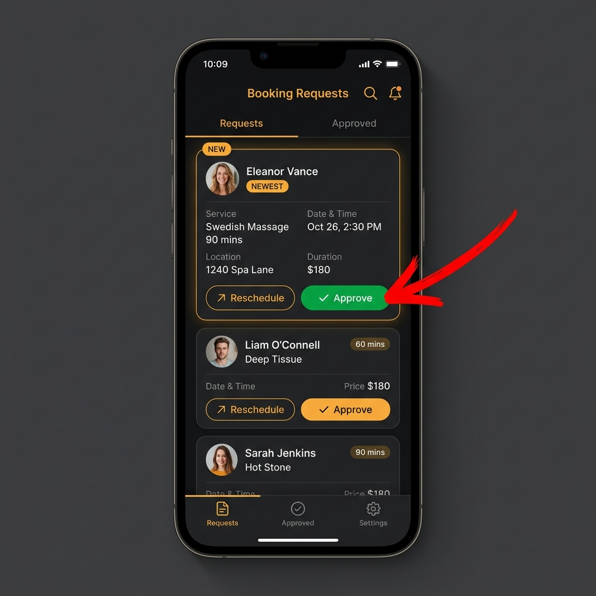
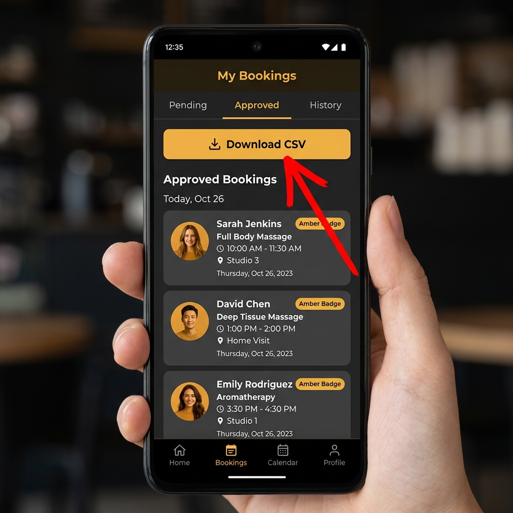
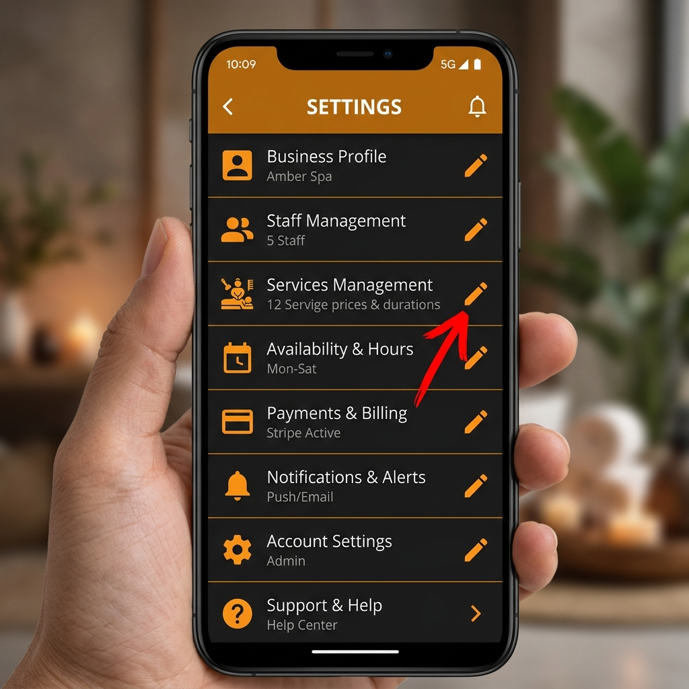

# Luxury Touch Massage - User Manual

Welcome to the **Luxury Touch Massage** management system! This manual will guide you, the Business Owner, on how to manage day-to-day operations using your Admin Dashboard App and explain how your customers interact with the Booking Website.

---

## 1. Introduction

Your system consists of two main parts:
1. **The Booking Website**: A public-facing website where your customers can view your services, prices, and book appointments.
2. **The Admin Dashboard App**: A private mobile application installed on your phone. This is your command center where you receive new bookings, approve them, and update your business details (like services offered and contact info).

---

## 2. The Booking Website (Customer View)

When customers visit your website, they will see:
- Your business name, tagline, and a beautiful hero image.
- A list of **Services** and **Optional Add-ons** along with descriptions, duration, and pricing.
- A **Booking Form** where they can select a service, pick a date & time, and provide their contact details.

**Note:** The information displayed on this website is entirely controlled by you. You can update the services, prices, and contact information directly from your **Admin Dashboard App** (see the *Settings Tab* section below).

---

## 3. The Admin Dashboard App

The core of your daily operations happens within the Admin App. It is divided into three main tabs at the bottom of the screen: **Requests**, **Approved**, and **Settings**.

### 3.1 Managing New Bookings (Requests Tab)

When a customer submits a booking from the website, it instantly appears in your **Requests** tab.

**How to Approve or Reschedule a Booking:**
1. Open the **Requests** tab (the first icon at the bottom).
2. Tap on any New Request card to view the full details (Customer Name, Service, Requested Date & Time, Email, Phone, and Special Notes).
3. A menu will slide up giving you two options: **Reschedule** or **Approve**.
4. **To Approve**: Tap the green **Approve** button. You will be asked to confirm the service location. Once confirmed, the booking moves to the *Approved* tab.
5. **To Reschedule**: Tap the **Reschedule** button. Choose a new date, time, and write a small note to the customer. Once sent, the status updates to rescheduled.

***

### 3.2 Viewing & Exporting Bookings (Approved Tab)

The **Approved** tab stores all upcoming and confirmed appointments.

**Features of the Approved Tab:**
- **View Schedule**: Quickly see your confirmed client list, what service they booked, and exactly when they are scheduled.
- **Download CSV**: If you need to export this list to your computer, accounting software, or print it out, tap the prominent **Download CSV** button at the top. This will save a spreadsheet file to your device's Downloads folder.

***

### 3.3 Site Settings & Service Management (Settings Tab)

The **Settings** tab acts as your remote control for the public Booking Website. *Any changes you make here will instantly update the website for your customers.*

**What you can manage:**
- **Services Management**: Add entirely new massage services, update prices, change descriptions, or edit the durations offered. 
- **Add-ons**: Within each service, you can create optional add-ons (like "Hot Stones" or "Aromatherapy") with their own extra price and time requirements.
- **Business Profile**: Edit your Business Name and Tagline.
- **Contact Info**: Update the Phone Number, Business Email, and Address which display at the bottom of your website.

**How to Edit:**
1. Navigate to the **Settings** tab (the gear icon).
2. Find the item you want to change (e.g., *Services Management*).
3. Tap the **Pencil Icon** next to it.
4. Type in your changes in the pop-up box and tap **Update** or **Save Service**. The changes are pushed to the live website immediately!

***

## Need Help?
If you encounter any technical issues with the app, such as a white screen or bookings not loading, please ensure your device has an active internet connection. If the issue persists, consult the `DEVELOPER_GUIDE.md` or contact your technical support provider for assistance.
